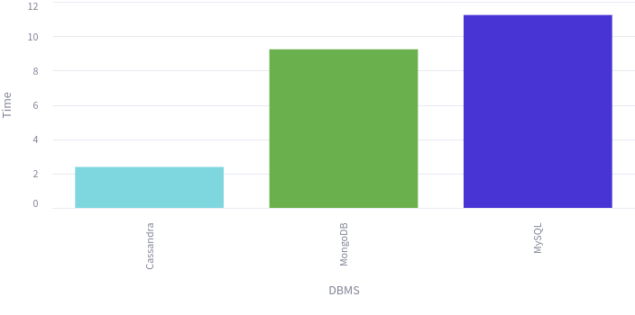
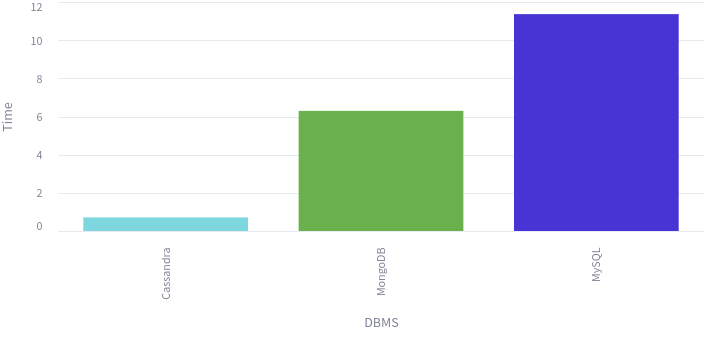

# Compare the performance of Cassandra and MongoDB

## Data schema

| Field | Type |
|:---:|:---:|
| **sensor** | **string** |
| **location** | **string** |
|**environment** | **string** |
| time | date |
| date | string |
| temperature | float |
| humidity | float |
| air_quality | float |
| pressure | float |
| wind_speed | float |
| wind_direction | string |
| gust_speed | float |
| dew_point | float |
| cloud_cover | float |
| visibility | float |
| precipitation_intensity | float |
| precipitation_type | string |
| uv_index | float |
| solar_radiation | float |
| soil_temperature | float |
| soil_moisture | float |

## Benchmark

### Insert 10,000 records

### Get all reports in a day of a sensor randomly

### Get all reports in a day of a location randomly

### Get all reports in a day of an environment randomly

